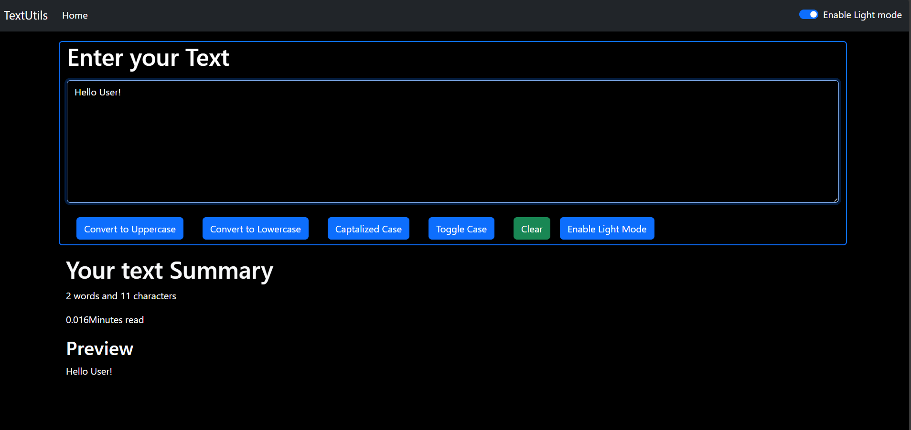

TextUtils

A lightweight React app that helps you manipulate text easily.
It converts text to UPPERCASE, lowercase, Toggle Case, and also lets you clear the text.
It shows word count, character count, a live preview, and supports Dark Mode.

## 📸 Screenshots

### Home Page

✨ Features

Convert to UPPERCASE
Convert to lowercase
Toggle case
Clear text
Word & character count
Live preview
Dark mode support

🔧 How to Run
npm install
npm start
Your app runs at: http://localhost:3000

📁 Tech Used

React.js
JavaScript
CSS
